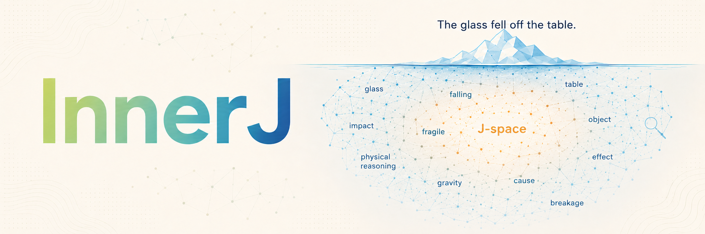

# innerJ

**What makes a latent variable reach a language model's self-report?**

A model computes plenty it never says. Ask it to *use* the language of a passage and it will; ask it to *name* that language and something different has to happen first. This repository is the benchmark and the causal toolkit for finding out what.

The answer we arrive at is **transport, not admission**. The variable is available in every arm — one shared linear probe reads it even where the task needs it for nothing — and what task demand changes is whether attention carries it into the position where the readout is taken.

The paper is not in this repository. Every number in it is machine-checked against the artifact that produced it — `innerj audit` is that check, and takes the paper source with `--tex`.

## 🔍 The question

Recent work identifies a set of directions whose contents a model can report on, a *verbalizable workspace*, and shows that a latent quantity is more present there when the task requires flexible reuse ([Gurnee et al., 2026](https://transformer-circuits.pub/2026/workspace/index.html)). That finding is behavioural and representational; the mechanism is left open.

The vocabulary invites a guess: a workspace has contents, contents are *admitted*, admission implies a gate. We looked for that gate on an open-weight model, at the position the account predicts, and it is not there.

## 📊 What we found

| | |
|---|---|
| **Visibility dissociates from decodability** | Flexible demand raises the concept's J-lens visibility by `ΔR_z = +0.089 [+0.080, +0.098]` against a control matched on prompt format **and** on accuracy to within noise of exactly zero, while one shared linear map decodes the variable in every primary arm at 6.4–9.0× its selection-corrected floor. |
| **Part of that demand is the operator, not the variable** | A fifth *supplied* arm applies the same operator to a value given in the prompt. It produces a shift 43% as large as the simple contrast **without inferring anything**, so that contrast is not by itself a latent-variable measure — and neither is any published effect built the same way. |
| **The mechanism is transport** | At matched readout distance, transport is concentrated in a mid-depth window by at least 17× over anywhere shallower under the non-saturating readouts (24.8–37.8× under log-rank, over four donor pairings); under the saturating percentile rank the same grid does not localise the window at all, which is a fact about that measure. Attention carries it in; no tested MLP output contributes positively inside the window. |
| **The window's edges are graded, not emergent** | Below it a value can be installed and does not survive to the readout; above it the intervention stops substituting and starts destroying. |
| **The behaviour partly runs through one J-lens direction** | Projecting the concept's static J-lens vector out of the stream costs half the counterfactual effect, and survives four controls: a random direction rescaled to remove the *same* activation norm, every rival concept as a null distribution, an orthogonalised one-vs-rest variant, and a donor-minus-target projection. |
| **A readout shift is not a calibrated measure of use** | Three components at one layer shift the lens readout to within 12% of one another and differ **7.4×** in what they do to behaviour. The readout is uncalibrated, not uninformative. |

Attention transporting a value to the query position is **convergent** with what is known about factual recall and in-context task vectors, not new. What is new is that the amount transported moves with *task demand* over an identical context, for a variable whose value that context never singles out.

**What does not generalise, up front.** The *concentration* does not. On the language family a single head at L39 matches both its own block and the whole residual stream to four decimal places, and `attn.L48` is a twenty-fifth of `attn.L39`; on a second family the two attention blocks are comparable and no head dominates, with L48 a linear-attention layer where no head decomposition is possible. The head is a case study, never the mechanism.

## The design

Each semantic instance yields five prompts over an **identical context**, so every contrast is within-instance and paired:

| Condition | Demand on `z` |
|---|---|
| `automatic` | must be used, never exposed |
| `report` | must be stated |
| `flexible` | must be passed into an operator the prompt defines |
| `control` | matched instruction that needs `z` for nothing |
| `supplied` | same operator, but the value is *given* — the composition without the inference |

`flexible − control` is the primary contrast: identical `"Answer:"` format, no demand for the variable. Crossing `supplied` with `report` separates latent-variable demand from the compositional work of applying an operator.

Two families: **language identity** on FLORES-200, which is *N*-way parallel so the counterfactual varies the latent variable and nothing else, and **object tracking** under swaps, where `z` is a progressively updated state.

## ⚙️ Setup

Python 3.13+, and one GPU with ~60 GB for the 27B primary checkpoint.

```bash
git clone https://github.com/parsa-mz/innerj.git && cd innerj
uv sync --extra dev

# The lens algebra comes from the authors' reference implementation, not a reimplementation.
git clone https://github.com/anthropics/jacobian-lens.git
uv pip install -e ./jacobian-lens

cp .env.example .env      # edit only if artifacts should live off the repo volume
```

`.env` holds the three paths that depend on the machine — where artifacts are written, where logs go, and `HF_HOME`. Set `HF_HOME` before the first run or a bare `hf download` re-pulls ~52 GB. Nothing else is location-dependent, so a fresh checkout runs with no source edits.

`uv sync` resolves against the committed `uv.lock`, so the dependency set is pinned. Verify the install without touching a GPU:

```bash
uv run pytest -n 16                 # 103 guard tests, ~10s
uv run ruff check innerj tests
```

> If `jacobian-lens` is missing, the test files that import it skip at *module* level — the suite still reads green with those tests silently dropped. Watch the passed count, not the colour.

## Running

Installing the project puts one `innerj` command on the path; `python -m innerj.cli <command>` is equivalent and is the form every number in the paper was produced with.

```bash
innerj --help           # every command, in the order they are run
```

CPU, seconds — generate a family with every design invariant enforced:

```bash
innerj build-dataset --family language --n 400
```

GPU — the primary result, then the rest of the chain:

```bash
innerj stage1 --records "$INNERJ_DATA_ROOT/language/Qwen3.6-27B_matched_n400_s0.jsonl" --limit 200
```

| Command | Question |
|---|---|
| `build-dataset` | Generate a family, enforcing every design invariant |
| `stage1` | Is visibility different from availability? Includes the 2×2 |
| `probe` | Is the variable decodable in every arm? |
| `screen` | Which components move the readout? |
| `sweep` | Where can a value be installed, at matched readout distance? |
| `attention` | Is the gather's attention route demand-dependent? |
| `specificity` | Does a patch favour the donor's concept over the target's? |
| `counterfactual` | Does it change the **answer**, against the distractor control? |
| `ablate` | Is the component selectively necessary? |
| `mediate` | Does the behaviour run through one J-lens direction? |
| `fit-lens` | Fit a Jacobian lens for a checkpoint |
| `gauge` | Which diagnostics survive a reparameterisation of the stream? |
| `figures` `audit` | Rebuild the figure deck; check every number in the paper against the artifacts |

Every command writes a `_results.json` **and** an `_observations.jsonl`, so any result can be re-pooled or re-split without re-running the GPU pass. A full replication is ~1.3 GB of artifacts, of which the fitted 9B lens is 1.2 GB and the probe's cached residuals are regenerable.

## Layout

| Path | What |
|---|---|
| `innerj/model.py` `patch.py` `positions.py` | Loading, the workspace band, component capture and patching |
| `innerj/analysis/` | `R_z`, `L_z` and `M_z`, forced choice, bootstrap, FDR, the ratio guard |
| `innerj/experiments/` | One module per causal experiment |
| `innerj/tasks/` | Condition generators, and the dataset invariants as constructor checks |
| `innerj/cli/` | Entry points behind one `innerj` command; `common.py` holds shared arguments and artifact writing |
| `innerj/figures/` | The figure deck and its shared style, built from artifacts only |
| `innerj/config.py` `console.py` | Paths from `.env`; progress that degrades to plain lines in a log |
| `tests/` | Guards for the invariants whose violation is silent |

## Two guards worth knowing about

Most guards here exist because their absence produced a confident wrong answer. Two are worth stating outside the code:

- A patch that **destroys** the computation drives the answer toward uniform, lifting the target symbol from ~0 to ~1/n for free. Comparing against the clean baseline reads destruction as transport — it produced six confident false positives in one run. The distractor control is unbiased against destruction *by construction*.
- **A percentile rank saturates.** On a 248,320-token vocabulary `R_z` separates rank 1 from rank 25 by 0.0001, and 92% of cells at the depths this project cares about read above 0.999. Every transport result is therefore reported under a log-rank companion as well, and the two disagree — they place the depth peak fifteen layers apart. A conclusion that holds under one and not the other is a fact about the measure.

Every effect size carries a bootstrap interval clustered on the semantic instance, since the arms share a passage; `excludes_zero` is the only significance claim made anywhere.

-----

## 📄 License

Code is MIT ([LICENSE](LICENSE)). **The released JGateBench records are CC BY-SA 4.0, not MIT** — every prompt quotes a FLORES-200 passage verbatim, and share-alike propagates. See [DATA_LICENSE.md](DATA_LICENSE.md). The vendored `jacobian-lens/` is cloned, not authored here, and carries its own terms.
